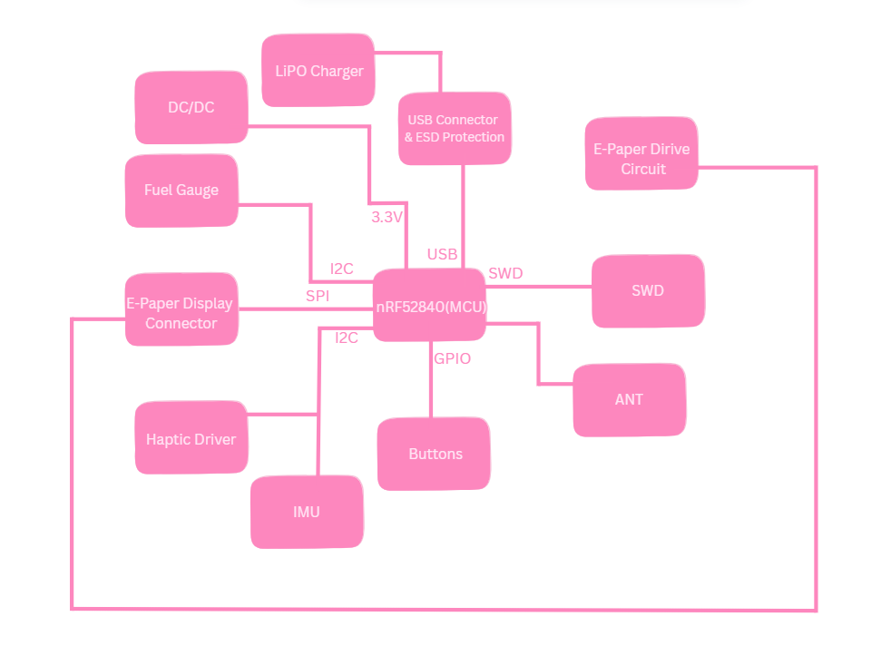
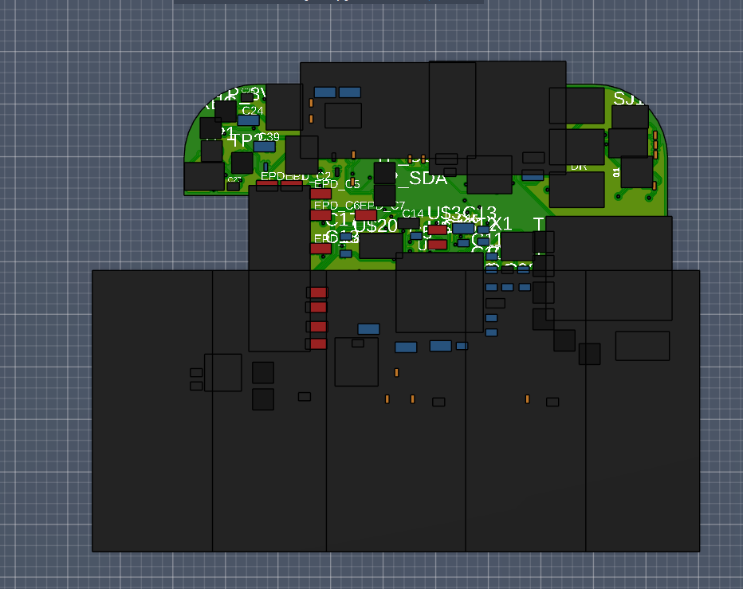

# Proiect InkTime: Smartwatch nRF52840

## 1\. Diagrama Bloc

Diagrama de mai jos ilustreaza interconexiunile dintre unitatea centrala (MCU) si perifericele sistemului.

## 2\. Descriere Hardware

Ceasul este construit in jurul lui **nRF52840**, ales special pentru ca e foarte eficient si are Bluetooth inclus. Ideea de baza: consumam curent doar cand e absolut necesar.

### 2.1. Creierul (MCU)
* **nRF52840:** Un cip puternic care stie si Bluetooth 5.0 si USB. Are doua cristale de cuart pentru precizie maxima la masurarea timpului.
* **Antena:** Semnalul pleaca spre o antena ceramica. Ca sa avem semnal bun, am decupat planul de cupru de sub ea (zona de "keep-out").

### 2.2. Power & Battery
* **incarcare (BQ25180):** Se ocupa de alimentarea bateriei LiPo prin USB-C. il controlam prin **I2C** ca sa stim cand s-a incarcat.
* **Fuel Gauge (MAX17048):** E senzorul. Ne spune exact cat % mai are bateria, cu o eroare de sub 1%.
* **Regulator (RT6160A):** Transforma tensiunea variabila a bateriei intr-un **3.3V stabil** pentru toate componentele.
* **Protectie ESD:** Langa mufa USB-C am pus un cip minuscul (USBLC6) care atenueaza socurile de electricitate statica sa nu prajim placa.

### 2.3. Ecran si Vibratii
* **E-Paper Display:** Cel mai mare avantaj. Consuma curent **doar cand schimba imaginea**. Daca ceasul sta pe loc, consumul e zero.
* **Driverul de ecran:** Pentru ca ecranul are nevoie de tensiuni mari ca sa miste cerneala electronica, am adaugat un circuit special cu diode si condensatori de 50V.
* **Vibratii (Haptic):** Folosim un driver **DRV2605** care misca motorasul. E mult mai destept decat un simplu tranzistor, oferind vibratii mai fine.

### 2.4. Senzori si Butoane
* **Miscare (BMA423):** Accelerometrul care numara pasii. L-am legat pe **I2C** si are pini de intrerupere (INT) ca sa „trezeasca” ceasul cand ridici mana.
* **Butoane:** Avem 3 butoane cu filtre hardware (rezistente si condensatori) ca sa nu avem probleme cu „apasarile false” (debounce).

## 3\. Asociere pini

| Grupa de pini | Pini folositi | Componenta | Justificarea alegerii / Functia |
| :--- | :--- | :--- | :--- |
| **I2C (SDA/SCL)** | **P0.26 / P0.27** | BQ25180, MAX17048, BMA423, DRV2605 | Magistrala comuna; pinii au fost pozitionati departe de zona antenei pentru a evita interferentele RF. |
| **Display (SPI)** | **P0.13, P0.14, P0.19** | E-Paper Connector | Rutare scurta si directa catre conectorul FPC, minimizand lungimea traseelor de mare viteza. |
| **Display Control** | **P0.20, P0.21, P0.23** | E-Paper Connector | Pini GPIO pentru semnalele de DC, Reset si Busy. Pinul Busy actioneaza ca intrerupere (INT). |
| **Power Gate** | **P0.24** | Tranzistor Q1 (Load Switch) | Ofera curent suficient pentru a comuta poarta MOSFET-ului, oprind complet ecranul in standby. |
| **Butoane & Alerte**| **P1.00 - P1.06** | Butoane externe, Alerte IMU / Baterie | Folosirea exclusiva a Portului 1 pentru semnale lente/intreruperi, izolandu-le de magistralele de date si permitand functia de Wake-Up eficient. |
| **Haptic Enable** | **P0.25** | DRV2605 (Motor Haptic) | Pin GPIO folosit pentru pornirea/oprirea cipului haptic. |
| **USB** | **VBUS, D+, D-** | Conector USB-C | Pini hardware dedicati ai PHY-ului intern nRF52840 pentru comunicatie nativa. |
| **Programare (SWD)** | **SWDIO, SWDCLK, SWO**| Conector Tag-Connect | Pini dedicati din fabrica pentru interfata Serial Wire Debug. |
| **Ceas (Oscilator)** | **P0.00, P0.01** | Cristal 32.768 kHz | Pini hardware dedicati (LFXO) pentru conectarea cristalului extern necesar functiilor de Low-Power Sleep. |

## 4\. BOM
| Qty | Componenta | Designator | Cod JLC / Sursa | Datasheet / Link |
| :--- | :--- | :--- | :--- | :--- |
| 1 | **nRF52840 (MCU)** | U1 | [C190740](https://www.google.com/search?q=https://jlcpcb.com/partdetail/NordicSemicon-NRF52840_QIAA/C190740) | [Datasheet](https://www.google.com/search?q=https://infocenter.nordicsemi.com/pdf/nRF52840_PS_v1.1.pdf) |
| 1 | **BMA423 (IMU)** | IC3 | [C262-BMA423](https://jlcpcb.com/parts) | [Datasheet](https://www.google.com/search?q=https://www.bosch-sensortec.com/media/boschsensortec/downloads/datasheets/bst-bma423-ds000.pdf) |
| 1 | **BQ25180 (Charger)** | IC1 | [C595-BQ25180](https://jlcpcb.com/parts) | [Datasheet](https://www.ti.com/lit/ds/symlink/bq25180.pdf) |
| 1 | **MAX17048 (Fuel Gauge)** | U3 | [C329239](https://jlcpcb.com/parts) | [Datasheet](https://www.google.com/search?q=https://datasheets.maximintegrated.com/en/ds/MAX17048-MAX17049.pdf) |
| 1 | **RT6160A (DC/DC)** | IC9 | [C835-RT6160](https://jlcpcb.com/parts) | [Datasheet](https://www.google.com/search?q=https://www.richtek.com/assets/product_pdf/RT6160A/DS6160A-02.pdf) |
| 1 | **DRV2605 (Haptic)** | IC4 | [C519213](https://jlcpcb.com/parts) | [Datasheet](https://www.ti.com/lit/ds/symlink/drv2605.pdf) |
| 1 | **E-Paper Conn (24 pin)**| J1 | [C262444](https://jlcpcb.com/parts) | [Link Molex](https://www.molex.com/en-us/products/part-detail/5034802400) |
| 1 | **USB-C (16 pin)** | J4 | [C719112](https://jlcpcb.com/parts) | [Datasheet](https://www.google.com/search?q=https://datasheet.lcsc.com/lcsc/2110271930_KINGHELM-KH-TYPE-C-16P_C2835407.pdf) |
| 1 | **Antena 2.45GHz** | ANT1 | [C96280](https://jlcpcb.com/parts) | [Datasheet](https://www.johansontechnology.com/datasheets/2450AT18B100.pdf) |
| 3 | **Butoane EVP-AKE31A** | SW1-SW3 | [C519154](https://jlcpcb.com/parts) | [Datasheet](https://www.google.com/search?q=https://industrial.panasonic.com/cdbs/www-data/pdf/SMG0000/SMG0000C191.pdf) |
| 1 | **USBLC6-2 (ESD)** | D3 | [C75248](https://jlcpcb.com/parts) | [Datasheet](https://www.st.com/resource/en/datasheet/usblc6-2.pdf) |
| 1 | **DMG2305UX (P-FET)** | Q1 | [C14388](https://jlcpcb.com/parts) | [Datasheet](https://www.diodes.com/assets/Datasheets/DMG2305UX.pdf) |

## 5\. Decizii

### 5.1. Decizii de amplasare a componentelor

Privind asezarea componentelor pe PCB, au fost luate urmatoarele decizii strategice pentru a optimiza spatiul si performanta:

* **Planuri de Masa (GND Pours) pe ambele straturi:** Am implementat poligoane de GND atat pe stratul Top, cat si pe Bottom, cusute cu via-uri (vias). Aceasta decizie are trei roluri majore:
    1.  **Ecranare EMI:** Reduce zgomotul electric dintre traseele de semnal.
    2.  **Disipare Termica:** Ajuta la disiparea caldurii generate de convertorul DC/DC si de circuitul de incarcare a bateriei.
    3.  **Referinta RF:** Ofera un plan de referinta solid pentru performanta optima a antenei Bluetooth.
* **Amplasarea Antenei (RF Keep-out Zone):** Antena ceramica de 2.4GHz a fost plasata pe extrema dreapta a placii.

* **Gruparea Circuitului E-Paper:** Componentele voluminoase si zgomotoase aferente display-ului (bobina, diodele si condensatorii pentru tensiunile de VGH/VGL) sunt grupate extrem de compact in stanga, imediat langa conectorul FPC. Aceasta mentine traseele de inalta tensiune scurte si departe de liniile sensibile ale MCU-ului.

### 5.2. Erori

#### Erori ERC (Electrical Rule Check)
* **Conflicte de alimentare (U1, U3):** Softul da eroare pentru ca mai multi pini `VDD` se leaga la aceeasi retea (`3V3` sau `VBAT`). Conexiunile sunt 100% corecte conform datasheet-urilor; eroarea apare doar pentru ca softul e prea strict cu regulile de „Power Source”.
* **Pinii de decuplare (DEC1, DEC4):** Aceeasi poveste la nRF52840. Pinii sunt legati corect la condensatori externi exact cum cere producatorul, dar softul nu ii recunoaste ca noduri clasice de alimentare.
* **Componente fara valoare (SJ1):** Jumper-ul de pe placa (SJ1) este doar un bridge fizic (Solder Jumper) folosit pentru configurare. Fiind un simplu contact de fludor, e normal sa nu aiba o valoare numerica (gen 10kΩ).
* **Erorile de tip "Only one pin on net"** (pe SDA/SCL) arata ca acele trasee sunt lasate libere.

#### Erori DRC (Design Rule Check)
Deoarece acest PCB este un *Proof of Concept* software si nu merge fizic la o fabrica, am prioritizat logica si functionalitatea in fata unui raport DRC complet verde:
* **Erori de margine (Board Outline Clearance):** Sunt 8 erori aici.Conectorul USB-C si butoanele sunt apropiate de marginile placutei, ceea ce declanseaza automat eroarea.
* **Suprapuneri pe planul de masa (Polygon Overlap):** Placa foloseste piese minuscule (0201/0402) si este foarte aglomerata. Am fortat poligonul de masa (GND) sa acopere cat mai mult spatiu pentru o buna disipare termica. Asta a generat niste erori de "clearance" la pad-uri, dar am preferat un plan de masa solid in detrimentul unui DRC perfect.
